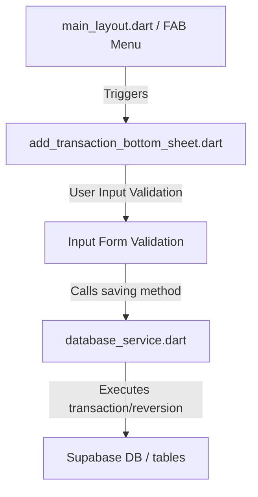

# Working README: Budget App v2 Documentation

This document describes how the application works, detailing the architecture, state management flow, database transaction rules, and UI components.

---

## 📱 Project Architecture & Flow

The application is a standard Flutter project configured with a **Supabase PostgreSQL backend**.

### 1. Balance Synchronization Rules
When transactions are added, edited, or deleted, account balances are updated synchronously from the client side (`database_service.dart`) using the following rules:

*   **Regular/Asset Accounts** (e.g. `checking`, `savings`, `liquid_assets`):
    *   **Inflow (+ amount)**: Increases the account balance.
    *   **Outflow (- amount)**: Decreases the account balance.
*   **Credit Card Accounts** (e.g. `credit` group):
    *   Balance represents *debt* owed.
    *   **Inflow (+ amount, i.e., Credit Payment)**: Decreases the debt balance (lowers the amount owed).
    *   **Outflow (- amount, i.e., Expense)**: Increases the debt balance (raises the amount owed).

### 2. Transfer Pair Matching Logic
A transfer transaction consists of two linked database rows:
*   **Source Transaction**: Stores the outflow (`-amount`) from the source account.
*   **Destination Transaction**: Stores the inflow (`+amount`) to the destination account.
*   Both rows share a matching tag with the unique prefix format `transfer_pair:[uuid]`.
*   Updating or deleting either side of a transfer automatically cascades to find the matched counterpart via the shared tag, reverts the balance calculations on both sides, and updates/cleans up both rows.

---

## 🎨 Visual Design System & UI Specifications

### 1. Stacked Pill Floating Action Menu
*   Controlled in [main_layout.dart](file:///c:/Users/yohnathanc/budget_app_v2/lib/features/navigation/main_layout.dart).
*   Consolidates labels and sub-option icons inside rounded horizontal pills styled with `StadiumBorder` shapes.
*   Uses a color-coded theme: **Lavender** (`0xFFE2E0FF`) for the primary action button ("Add Transaction") and **Purple** (`0xFFCEBFFF`) for secondary actions.
*   The main toggle FAB is circular, rotates 45 degrees into an "X" on press, and transitions from a Volt Green highlight to a muted Slate Purple when active.

### 2. Add Transaction Bottom Sheet
*   Managed in [add_transaction_bottom_sheet.dart](file:///c:/Users/yohnathanc/budget_app_v2/lib/features/transactions/add_transaction_bottom_sheet.dart).
*   **Auto-fitting Height**: The sheet wraps its content height dynamically using `mainAxisSize: MainAxisSize.min` instead of taking up a static amount of screen space.
*   **Dynamic Outlined Fields**:
    *   Empty fields display in a standard M3 filled style.
    *   When fields have content (e.g., text typed or dropdown item selected), they transition immediately into a clean, border-outlined text field style.
*   **Rounded Border Inputs**: All text inputs and dropdown containers feature `BorderRadius.circular(16)` styling.

---

## 🔧 Form Fields & Logic Details

*   **Date Selector (Date Only)**:
    *   Clicking the Date card opens the date selection modal. Time selector is hidden.
    *   The chosen date is merged with `DateTime.now()` under the hood, ensuring the transaction timestamp is logged at the exact time of entry.
*   **Searchable Category Autocomplete**:
    *   Typing inside the text input filters suggestions in real-time.
    *   Tapping a suggestion completes the select state, updates the controller, and closes the panel.
    *   Category selections are not prefilled by default.
*   **Searchable Account Autocomplete**:
    *   Works identically to Category search.
    *   **Income tab default**: Defaults the selection to the primary checking/"Debit" account.
    *   **Transfer tab prefill constraints**: Defaults the *Source* account to the debit account, but leaves the *Destination* account empty (`null`) to force user input.
*   **Numeric Constraints & Warnings**:
    *   The Amount field intercepts typing using a `DecimalTextInputFormatter` to only permit numbers and a single decimal point (capped at 2 decimal places).
    *   Attempts to validate letters will generate a Material red validation warning: *"Letters not allowed"*.
*   **Alphabetical Ordering**:
    *   Both Category suggestions and Account lists are sorted alphabetically during DB load.
*   **Archived Account Filtering**:
    *   Accounts whose status attribute is `'archived'` are filtered out and completely omitted from select states.
