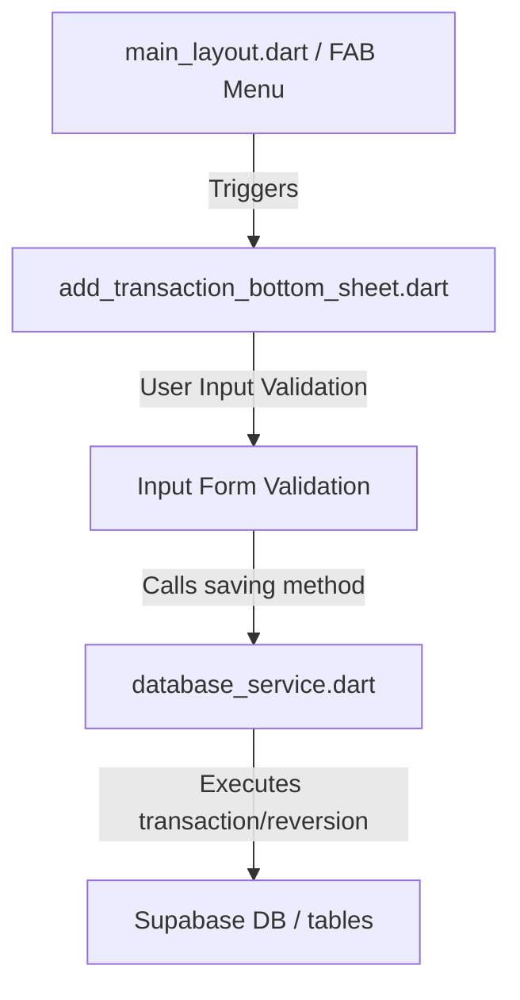

# Working README: Budget App v2 Documentation

This document describes how the application works, detailing the architecture, state management flow, database transaction rules, and UI components.

---

## 📱 Project Architecture & Flow

The application is a standard Flutter project configured with a **Supabase PostgreSQL backend**.

### 1. Balance Synchronization Rules
When transactions are added, edited, or deleted, account balances are updated synchronously from the client side (`database_service.dart`) using the following rules:

*   **Regular/Asset Accounts** (e.g. `checking`, `savings`, `liquid_assets`):
    *   **Inflow (+ amount)**: Increases the account balance.
    *   **Outflow (- amount)**: Decreases the account balance.
*   **Credit Card Accounts** (e.g. `credit` group):
    *   Balance represents *debt* owed.
    *   **Inflow (+ amount, i.e., Credit Payment)**: Decreases the debt balance (lowers the amount owed).
    *   **Outflow (- amount, i.e., Expense)**: Increases the debt balance (raises the amount owed).

### 2. Transfer Pair Matching Logic
A transfer transaction consists of two linked database rows:
*   **Source Transaction**: Stores the outflow (`-amount`) from the source account.
*   **Destination Transaction**: Stores the inflow (`+amount`) to the destination account.
*   Both rows share a matching tag with the unique prefix format `transfer_pair:[uuid]`.
*   Updating or deleting either side of a transfer automatically cascades to find the matched counterpart via the shared tag, reverts the balance calculations on both sides, and updates/cleans up both rows.

---

## 🎨 Visual Design System & UI Specifications

### 1. Stacked Pill Floating Action Menu
*   Controlled in [main_layout.dart](file:///c:/Users/yohnathanc/budget_app_v2/lib/features/navigation/main_layout.dart).
*   Consolidates labels and sub-option icons inside rounded horizontal pills styled with `StadiumBorder` shapes.
*   Uses a color-coded theme: **Lavender** (`0xFFE2E0FF`) for the primary action button ("Add Transaction") and **Purple** (`0xFFCEBFFF`) for secondary actions.
*   The main toggle FAB is circular, rotates 45 degrees into an "X" on press, and transitions from a Volt Green highlight to a muted Slate Purple when active.

### 2. Add Transaction Bottom Sheet
*   Managed in [add_transaction_bottom_sheet.dart](file:///c:/Users/yohnathanc/budget_app_v2/lib/features/transactions/add_transaction_bottom_sheet.dart).
*   **Auto-fitting Height**: The sheet wraps its content height dynamically using `mainAxisSize: MainAxisSize.min` instead of taking up a static amount of screen space.
*   **Dynamic Outlined Fields**:
    *   Empty fields display in a standard M3 filled style.
    *   When fields have content (e.g., text typed or dropdown item selected), they transition immediately into a clean, border-outlined text field style.
*   **Rounded Border Inputs**: All text inputs and dropdown containers feature `BorderRadius.circular(16)` styling.

---

## 🔧 Form Fields & Logic Details

*   **Date Selector (Date Only)**:
    *   Clicking the Date card opens the date selection modal. Time selector is hidden.
    *   The chosen date is merged with `DateTime.now()` under the hood, ensuring the transaction timestamp is logged at the exact time of entry.
*   **Searchable Category Autocomplete**:
    *   Typing inside the text input filters suggestions in real-time.
    *   Tapping a suggestion completes the select state, updates the controller, and closes the panel.
    *   Category selections are not prefilled by default.
*   **Searchable Account Autocomplete**:
    *   Works identically to Category search.
    *   **Income tab default**: Defaults the selection to the primary checking/"Debit" account.
    *   **Transfer tab prefill constraints**: Defaults the *Source* account to the debit account, but leaves the *Destination* account empty (`null`) to force user input.
*   **Numeric Constraints & Warnings**:
    *   The Amount field intercepts typing using a `DecimalTextInputFormatter` to only permit numbers and a single decimal point (capped at 2 decimal places).
    *   Attempts to validate letters will generate a Material red validation warning: *"Letters not allowed"*.
*   **Alphabetical Ordering**:
    *   Both Category suggestions and Account lists are sorted alphabetically during DB load.
*   **Archived Account Filtering**:
    *   Accounts whose status attribute is `'archived'` are filtered out and completely omitted from select states.

---

## 🔍 Transactions Page Filtering, Search, & Styling

*   **Search bar & Date Picker alignment**:
    *   The Date Picker button has been repositioned to sit horizontally next to the search field in the app bar.
    *   It displays the formatted date parameter dynamically (e.g., 'All Time' or 'Since: MMM dd').
*   **Search by Amount**:
    *   The search filter has been upgraded to scan for numeric amounts in addition to descriptions and tags.
    *   If the search query parses as a valid double value, the Supabase query checks for absolute and negative matches against the database `amount` column (`amount.eq.$absVal` or `amount.eq.-$absVal`).
*   **Transaction Type Choice Chips**:
    *   Horizontal scrollable chips (`All`, `Expense`, `Income`, `Transfer`) are displayed just below the search field.
    *   Selecting a chip filters the transaction list by matching category types (`expense`/`tax` for Expense, `income`/`reimbursement` for Income, and `transfer` for Transfer).
*   **Unified Reset Logic (Clear Filters)**:
    *   A white `Clear Filters` button is displayed dynamically when any filter is active.
    *   Tapping it clears the search input, clears the type selection, and reverts the date back to the initial 15-day-ago default preset.
*   **Color-coded Transfer Amounts**:
    *   To improve scan-ability, transaction items of type `transfer` render their amounts in **Google Blue** (`0xFF4285F4`), whereas other transactions are green (inflow) or red (outflow).

---

## 📊 Dashboard Page Metrics & Cards Logic

The four summary cards at the top of the Dashboard are structured as follows:

1.  **Total Checking**: Calculates and displays the total sum of all active accounts of type `"checking"` (excluding any account named `"Holding"` by default). Tapping the card toggles a state that adds the balance of the account named `"Holding"` to this sum, updating the card title dynamically to `"Checking + Holding"`. Tapping it again reverts it to the default.
2.  **Credit Card Debt**: Calculates and displays the total sum of all active accounts of type `"credit_card"`.
3.  **Net Checking vs Credit**: Calculates the net difference: `checking_sum - credit_card_sum`. It dynamically updates based on the toggled state of Card 1 (using `checking + holding` if active, or just `checking` if inactive) and highlights with **Lime Moss** (`0xFF7DAC20`) if the net balance is non-negative, and **Cinnabar** (`0xFFEE4D44`) if the net balance is negative.
4.  **Retirement Savings**: Calculates and displays the total sum of all active accounts belonging to the `"retirement"` account group.

### Formatting Specifications
*   All numeric values displayed on the dashboard cards are formatted under the US locale standards with proper thousands separator commas and two decimal places (e.g., `"$1,234,567.89"` or `"$0.00"`).
*   This uses the `intl` package's `NumberFormat.currency(locale: 'en_US', symbol: '\$')` standard.### 5. Cash Flow Overview Line Graph
*   **Data Aggregation Period**:
    *   **Last 60 Days (default)**: Computes and plots checking account income vs credit card expenses over the last 60 days.
    *   **Current Month**: Dynamically maps checking account income vs credit card expenses from the 1st of the current month until the last day of the current month.
*   **Pills / Range Selection Toggle**:
    *   An interactive, pill-style segmented control chip (designed using **Google Blue** `#4285F4` for the selected state) next to the chart title lets users choose between **60 Days** and **This Month**.
    *   Since all transactions for the last 60 days are fetched in a single query, switching ranges is entirely local, instantaneous, and performs zero additional database queries.
*   **Cumulative vs Daily View Toggle**:
    *   An interactive segmented toggle above the chart allows the user to view either **Cumulative Sums** (step-like rising trends of total income vs total expenses) or raw **Daily Totals**.
*   **Database Query Logic**:
    *   **Checking Income**: Filtered for transactions on checking accounts (`account.type == 'checking'`) with positive amounts (`tx.amount > 0`) categorized as `income` or `reimbursement`.
    *   **Credit Card Expenses**: Filtered for transactions on credit card accounts (`account.type == 'credit_card'`) with negative amounts (`tx.amount < 0`) categorized as `expense` or `tax`.
*   **Hot-Reload Web Safety**:
    *   The state variables `_chartTransactions`, `_chartMode`, and `_chartRange` are cast to `dynamic` inside `_getMainChartData()` to prevent JavaScript runtime crashes (`TypeError: this[_chartTransactions] is not iterable`) during Flutter Web hot reloads.
*   **Dynamic Chart Formatting**:
    *   The Y-axis maximum bounds (`maxY`), grid line spacing, and labels are computed dynamically depending on the maximum data point value to ensure visual scaling across any range of values.

### 6. Category Expenses Donut Chart
*   **Ongoing Month Focus**: Only aggregates and displays expenses within the ongoing (current) calendar month (from the 1st day of the current month to the current moment).
*   **Parent-Child Category Aggregation**: Automatically groups any transaction linked to a subcategory (a category with a non-null/non-empty `parentId`) under its corresponding parent category. Transactions linked directly to a parent category or a category without a parent are grouped under themselves.
*   **Upscaled Donut Layout**: Rendered in a large (280x280) layout using `PieChart` from `fl_chart`. It features a clean, minimal design without text overlays on segments, displaying a total expense summary at the center.
*   **Dual Hover & Focus Highlight**: Hovering over a donut chart segment highlights that segment and visualizes a hover state on the category item in the legend list. Hovering over a legend item highlights that item and highlights the corresponding donut segment in the chart.
*   **Harmonious Color Palette**: Segment colors are resolved dynamically from the category's `colorHex` field, with a pre-defined premium fallback palette.

---

### 7. Currency API Caching, Settings, & Real-Time Portfolio Valuation
*   **Navigation & Entrance Flow**:
    *   A Settings gear icon has been integrated into the Custom Navigation Rail (desktop sidebar) and App Bar actions (mobile). Selecting the gear opens the stateful `SettingsPage`.
*   **Active Currencies Management**:
    *   Allows toggling/removing active currencies, displaying their latest USD valuation, and adding new physical/crypto currency symbols.
    *   Default tracking list: `USD`, `MXN`, `SOL`, `KMNO`.
*   **Rate Limits and Caching**:
    *   To respect API caps, sync check executes at most **twice per day** with an 8-hour gap requirement, caching results in `SharedPreferences`.
    *   Any custom currency symbol added by typing is instantly added to the active list and fetched during the next session login.
    *   Diagnostics logs and daily sync quotas are displayed in a terminal console under the API Diagnostics tab.
*   **API Interceptor Routing**:
    *   Standard currencies/assets are processed sequentially with a 1-second delay via **AlphaVantage** (`CURRENCY_EXCHANGE_RATE` and `GLOBAL_QUOTE` functions).
    *   The **KMNO** cryptocurrency token is intercepted and queried using the **CoinMarketCap** simple price endpoint to ensure lookup availability.
*   **Cross-Currency Asset Reconciliations**:
    *   Asset values are cached in USD and dynamically converted to the account's base currency code on the Assets Page:
        $$\text{Current Price (Account Local)} = \frac{\text{USD Cached Price}}{\text{Account Base Currency Rate (USD)}}$$

